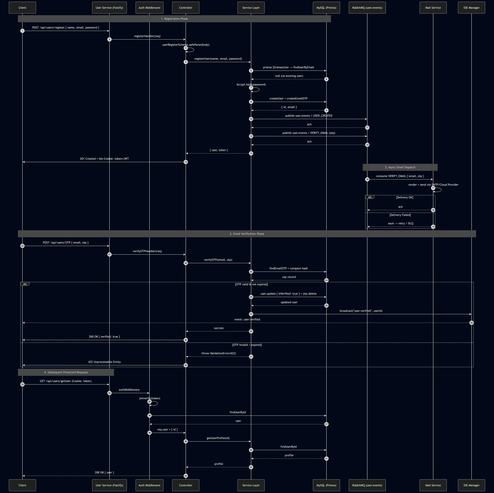
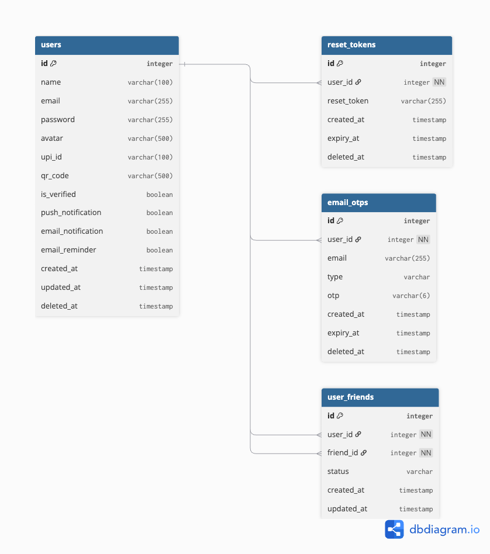
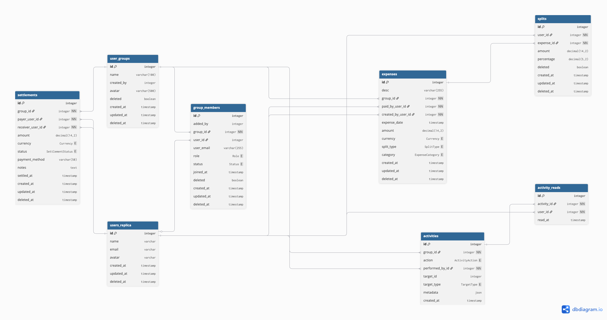
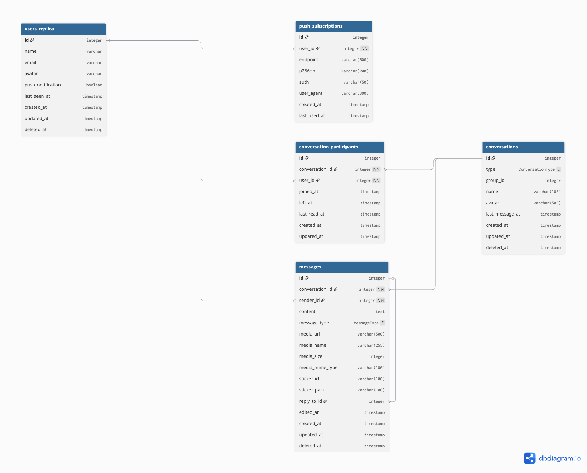
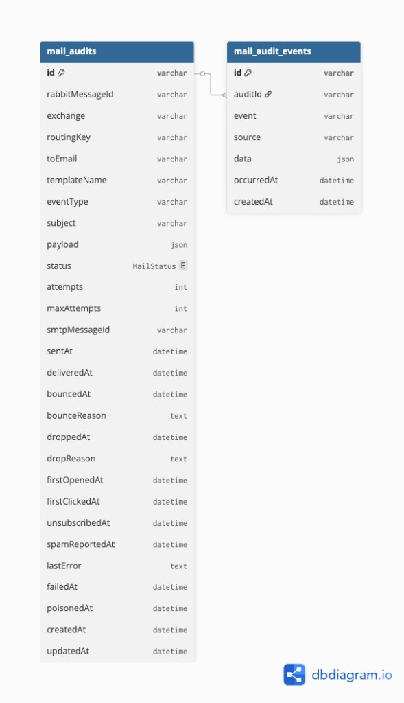
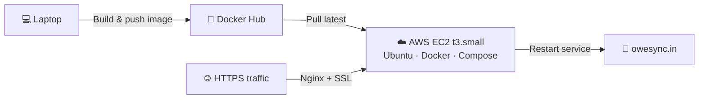

# OweSync

### Track shared expenses, settle up, and chat — built on an event-driven microservices stack.

A production-style expense-sharing platform — 4 backend services, 1 React frontend, glued together by RabbitMQ, MySQL-per-service, Redis, and real-time sockets.

**[Live Demo](https://www.owesync.in)** · **[Demo Video](<your-video-url>)** · 

---

## Try It as an App

OweSync is a **Progressive Web App (PWA)** — install it from your browser and it behaves like a native app. No App Store, no download. You get a home-screen icon, full-screen mode, push notifications, and offline access to already-loaded data.

### 📱 Android (Chrome)

1. Open [owesync.in](https://www.owesync.in) in **Chrome**.
2. Tap the **three-dot menu** (⋮) at the top-right.
3. Select **"Add to Home screen"** → **Install**.

### 🍎 iOS (Safari)

1. Open [owesync.in](https://www.owesync.in) in **Safari** (PWA install works only in Safari on iOS).
2. Tap the **Share** icon at the bottom (square with an up-arrow).
3. Scroll down and tap **"Add to Home Screen"** → **Add**.

Launch OweSync from your home screen for the best experience — no browser chrome, push notifications route to the OS, and the app stays resident in app-switcher.

---

## The Problem

You just got back from a 5-day trip with people you barely knew — a hostel group, a Couchsurfing crew, a travel meetup. You shared taxis, dinners, a rental. Someone floated the Airbnb deposit. Now you need to:

- Figure out who owes whom, without doing math on a napkin.
- Share the 200 photos everyone took, without adding each other on Instagram or WhatsApp.
- Remember where you were, who was there, and what actually happened — a week from now, and a year from now.

The problem isn't just *splitting expenses.* It's that the **people, money, photos, and memories** of a shared experience live across five different apps — Splitwise, WhatsApp, Google Photos, Maps, Notes — and none of them talk to each other. You don't want to give strangers your phone number. You do want the trip to outlive the trip.

**OweSync** is the shared space that ties it all together — expenses, settlements, real-time updates, group conversations, and the photos and locations from the experience itself — scoped to the group, not your contacts list.

## Why Microservices?

A platform like this has wildly different workloads under one roof — transactional writes (expenses, settlements), real-time fan-out (group messaging, activity feed), media handling (photos, receipts), and async side-effects (emails, push notifications). Building it as a monolith forces all of them to scale together and fail together.

OweSync splits these concerns across four independently deployable services that communicate through **RabbitMQ topic exchanges** and maintain their own databases:

- **Isolation of failure** — the mail service going down doesn't block an expense from being created.
- **Independent scaling** — media + real-time messaging (chat service) scales on a different axis than the transactional core.
- **Clear ownership boundaries** — each service owns its schema, its domain logic, and its deploy cadence.
- **Realistic trade-offs** — eventual consistency, idempotent consumers, and data replication patterns (`UserReplica`) you'd actually see in production systems.

---

## Architecture at a Glance

  

OweSync runs as **four backend services + one frontend**, each with its own MySQL database and a single RabbitMQ broker tying them together. There are no synchronous service-to-service REST calls on the write path — cross-service state is propagated through **topic exchanges** and rebuilt locally by each consumer.

**Communication patterns at a glance:**

| Channel | Used for | Example |
|---|---|---|
| **REST (HTTPS)** | Client → service reads & writes | Frontend calling `/expenses`, `/groups`, `/messages` |
| **RabbitMQ topic exchanges** | Service → service async events | `group.created` fan-out to Chat + Mail |
| **Socket.IO (WebSocket)** | Server → client real-time | Chat messages, typing, read receipts |
| **SSE (Server-Sent Events)** | Server → client one-way stream | Live activity feed updates |
| **Web Push (VAPID)** | Server → browser background | Push notifications when the app is closed |

**Data patterns:**

- **DB-per-service** — no shared schema, no cross-service joins.
- **UserReplica** — Chat and Core keep a denormalized, read-only copy of user rows, kept in sync via `user.replica.events`. Read path stays fast, no cross-service call required when rendering a conversation or an expense.
- **Idempotent consumers** — every event handler is safe to retry. RabbitMQ guarantees *at-least-once* delivery; idempotency makes it functionally behave like *exactly-once*.
- **Soft deletes + audit trail** — destructive actions are tombstoned, every state change is logged to an `Activity` table and streamed to clients via SSE.

---

## The Services

| Service | Responsibility | Stack | Port | Repo |
|---|---|---|---|---|
| **Core** | Groups, expenses, splits, settlements, activity feed (SSE) | Fastify · TypeScript · MySQL · Prisma · RabbitMQ | `6001` | [🔗 OweSync-Core-Service](https://github.com/abhi08-04/OweSync-Core-Service) |
| **User** | Auth, profiles, Google OAuth, sessions, friends | Fastify · TypeScript · MySQL · Redis · JWT · bcrypt | `3000` | [🔗 OweSync-User-Service](https://github.com/abhi08-04/OweSync-User-Service) |
| **Chat** | Real-time conversations, media, push notifications | Fastify · TypeScript · MySQL · Socket.IO · web-push | `7000` | [🔗 OweSync-Chat-Service](https://github.com/abhi08-04/OweSync-Chat-Service) |
| **Mail** | Async transactional email, delivery audit + SendGrid webhooks | Fastify · TypeScript · MySQL · Prisma · Nodemailer · EJS | `5000` | [🔗 OweSync-Mail-Service](https://github.com/abhi08-04/OweSync-Mail-Service) |
| **Frontend** | SPA + PWA | React 18 · Vite · TypeScript · Tailwind · Radix · Recharts | `80 / 443` | [🔗 OweSync-Frontend](https://github.com/abhi08-04/OweSync-Frontend) |

---

## Tech Highlights

- **Event-driven inter-service sync** via RabbitMQ topic exchanges (`group.events`, `user.replica.events`) — no synchronous cross-service REST.
- **At-least-once delivery + idempotent upserts** — consumers can replay the same event safely. Unique constraints + `upsert` turn the "at-least-once" guarantee into effective "exactly-once" semantics.
- **`UserReplica` denormalization pattern** — Chat and Core cache a read-only copy of each user's identity row, updated by consuming `user.replica.events`. Eliminates cross-service calls on every message render or expense lookup.
- **Real-time duo** — Socket.IO for bidirectional chat (rooms per conversation, read receipts, typing indicators) and SSE for the one-way activity feed.
- **Strategy pattern for expense splits** — `EqualSplit`, `ExactSplit`, `PercentSplit` resolved via a `SplitFactory`, each with its own `normalize` + `validate` contract.
- **Settlement optimizer** — pair-wise net balances fed through a greedy min-transaction matcher to suggest the fewest payments needed to zero a group out.
- **Shared JWT auth in httpOnly cookies** — same token works across all services; Socket.IO handshake validates it before joining rooms.
- **Media pipeline** — Cloudinary streams for avatars, receipts, and chat media. Signed uploads, CDN-backed delivery.
- **Web Push (VAPID)** — offline recipients of a chat message get a browser/OS-level notification; `PushSubscription` rows are reused across devices.
- **Containerized, published, orchestrated** — each service builds a Docker image published to Docker Hub and runs behind a shared Docker network via Docker Compose.

---

## Key User Flows

Detailed sequence diagrams for the flows that matter most.

### 1. User Registration & Email Verification

  

A synchronous registration response followed by asynchronous email dispatch. The User Service writes the `User` row and OTP inside a single Prisma transaction, publishes a `VERIFY_EMAIL` event to RabbitMQ, and returns a JWT cookie immediately. The Mail Service consumes the event independently — if SMTP is down, the message sits in the queue (or lands in a DLQ after retries) without affecting signup.

### 2. Create Expense → Settle Up

  

Expense creation pipes the payload through a `SplitFactory` (strategy pattern) so that equal, exact, and percent splits all validate against the same `sum(splits) == amount` invariant. `Expense.create`, `Split.createMany`, and `Activity.create` run inside a single Prisma transaction so a partially-written expense is impossible. On commit, `group.events / EXPENSE_CREATED` is published to RabbitMQ and the activity is broadcast to clients over SSE. Settlement suggestions are computed by reducing all expenses + splits + prior settlements into pair-wise net balances and feeding them to a greedy min-transaction matcher.

### 3. Real-time Chat — Send, Deliver, Notify

  

Socket.IO handshake validates the JWT cookie before the socket joins its per-conversation room. Messages persist via REST, then fan out over WebSocket to online participants and via Web Push to offline ones — two parallel delivery paths, one source of truth. Media messages take an alternate path through Cloudinary before hitting the same `messageService.create`, so the downstream "emit + push" logic stays identical regardless of content type. Read receipts are their own lightweight event (`read:receipt`) to keep the write path small.

---

## Database Design

Each service owns its schema — no shared tables, no cross-service joins. The only data replicated across services is the minimal identity row (`UserReplica`), synced via events.

### User Service

  

Identity & auth: credentialed users, email OTPs, password reset tokens, and a friends graph. Payment identifiers (`upi_id`, `qr_code`) live here so the core service can surface them during settlement without storing duplicates.

### Core Service

  

The transactional heart of the platform — groups, members, expenses, splits, settlements, and an activity stream with per-user read tracking. `users_replica` is the denormalized identity mirror populated from RabbitMQ events.

### Chat Service

  

Conversations (direct + group), participants, messages (text / image / file / sticker), and push subscriptions. `users_replica` here is the same denormalization pattern — Chat never makes a synchronous call to User to render a sender's name or avatar.

### Mail Service

  

Outbound mail lifecycle: each consumed Rabbit message becomes a `mail_audits` row (`MailStatus` from queue through SMTP, delivery, bounces, and poison handling). `mail_audit_events` stores an append-only timeline per audit (consumer progress, webhook payloads, errors) so ops can reconstruct what happened without rereading the broker.

---

## Deployment

OweSync runs in production on a single **AWS EC2 `t3.small`** instance (2 vCPU · 2 GB RAM · 20 GB EBS) behind **Nginx** for TLS termination and reverse proxying. All services are containerized, published to Docker Hub, and orchestrated via Docker Compose on a shared `owesync-network` bridge.

### Release Pipeline

Manual and SSH-driven — no CI runner, no secrets outside the server, full control over what ships when.

Because Compose restarts only the affected service, the rest of the stack keeps serving traffic — a chat deploy doesn't bounce the core service, and vice versa.

### Edge Layer

- **Nginx** sits on the host's `:80` / `:443`, terminating TLS and reverse-proxying to each service's container port over the internal bridge network.
- **HTTP → HTTPS** redirect enforced at the Nginx layer.
- **WebSocket upgrade headers** forwarded for the Chat service so Socket.IO handshakes succeed through the proxy.
- `owesync.in` resolves directly to the EC2 public IP.

Each service exposes a `/health` endpoint (including `/health/rabbitmq` for consumers) so the orchestrator can gate traffic until downstream dependencies are reachable.

---

